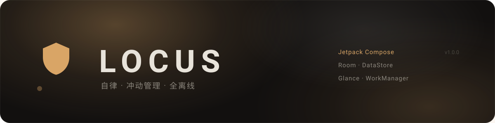
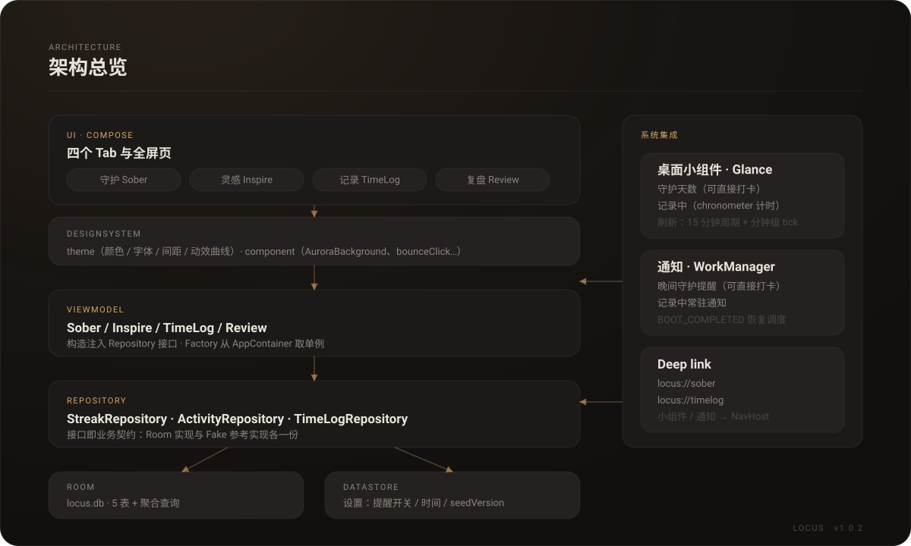

<p align="center">
  
</p>

<p align="center">
  
  
  
  
</p>

自律 / 冲动管理 Android App。深色「墨石 Inkstone」设计系统，**全离线**：不联网、无账号、无推送，所有数据留在本机。

> 不是计划表，是「冲动来了怎么办」的随身工具：打卡守护、冲动冲浪、把时间花在哪看一眼就知道。

## 功能

### 守护（Sober）
- 连续守护天数 + 个人最佳识别；中央大数字配三层脉动环、双旋转弧光与呼吸光晕
- 冲动曲线：近 7 日最强冲动归一化波浪线，入场从左到右绘制
- **一键打卡**：心情 1–5 + 可选备注 → 保存后播放琥珀粒子庆祝动画；同一天重复打卡只更新原记录，今日已打卡后卡片变「今日已守护」
- **SOS 冲动急救**：先选强度（轻 / 中 / 强），三个出口
  1. 我只是记录一下 —— 记录 UrgeEvent
  2. 我要做冲浪练习 —— 10 分钟 4-2-6 引导呼吸（全屏页：呼吸圆 + 多层光环 + 倒计时 + 底部波浪），结束时可选「平复了」写回冲浪时长
  3. 给我找点事做 —— 跳转灵感页并预筛「冲动急救」分类

### 灵感（Inspire）
- 20 条内置活动库（首次建库自动预置），按分类筛选、随机推荐三张卡
- 「换一批」走 淡出 → 停顿 → 交错淡入（每张卡晚 100ms）

### 记录（TimeLog）
- 手动开始 / 结束计时：记录中卡片带流动边框 + 呼吸圆点 + 秒级计时；周日历可切日期，历史时间线按开始时间排序
- 常用活动由 `time_logs` 按名称聚合（GROUP BY），随记录自动更新
- 跨天记录归属开始当天

### 复盘（Review）
- 时间去向：本周 7 根柱（无数据保留 2dp 底槽不塌陷），选中柱高亮显示时长
- 冲动曲线：近 7 日 / 近 30 日切换，描边绘制动画
- 守护日历：本月网格，打卡日琥珀实心圆、今天描边圈、未来日期禁用，月视图可翻月
- 周 / 月切换数据区 Crossfade

### 桌面小组件（Jetpack Glance）
- **守护天数**（4×2）：大号天数 + 状态行 + 「打卡」按钮（不打开 App 直接写入），点空白区进守护页
- **记录中**（4×1）：活动名 + 系统 chronometer 实时计时 + 「结束」按钮；空闲时引导去记录页

### 通知
- **晚间守护提醒**：按设置时间每日触发（默认 21:30），当天已打卡则不发，通知内可直接打卡
- **记录中常驻通知**：计时交给系统 chronometer 渲染，非前台服务（省电、无 FGS 类型合规问题）
- Android 13+ 在用户首次点「打卡守护 / 开始记录」时申请通知权限，拒绝则静默降级

## 技术栈

| 项 | 内容 |
| --- | --- |
| UI | Jetpack Compose（自建设计系统，颜色只走 token）；Aurora 光效组件、bounceClick 手感 |
| 数据 | Room 2.8（5 张表 + 聚合查询 + TypeConverter）、DataStore（设置）、Repository 接口 + Room / Fake 双实现 |
| 后台 | WorkManager（小组件 15 分钟兜底 + 记录中分钟级自续期 tick、晚间提醒 24h 周期）、Glance 1.2 小组件 |
| DI | 手动 `AppContainer`（无 Hilt） |
| 其他 | KSP、navigation-compose（deep link `locus://sober`、`locus://timelog`）、minSdk 26 / targetSdk 37 |

## 架构

<p align="center">
  
</p>

分层原则：UI 只依赖 ViewModel，ViewModel 只依赖 Repository 接口（Room 与 Fake 双实现，接口即业务契约）；小组件与通知同样经由 Repository 读写，不绕过数据层。

## 目录结构

```
TakeControl/
├── app/                      # Gradle 根
│   ├── app/                  # :app 模块（源码在 app/app/src/main/）
│   ├── gradle/               # version catalog：依赖统一走 libs.versions.toml
│   ├── keystore/             # 发布密钥（.gitignore，不入库）
│   └── keystore.properties   # 签名密码（.gitignore，不入库）
├── design/                   # 三版设计稿（HTML）
└── docs/                     # 00 项目总览 / 01 设计系统 / 02 信息架构 / 03-12 各阶段规格
```

包结构（`com.locus.app`）：

```
core/model            数据模型（Streak / Urge / Activity / TimeLog / DailyCheckIn）
core/data             仓库接口 + Room 实现（room/、local/）+ 参考用 Fake（fake/）
designsystem/theme    颜色、字体、间距、动效曲线等 token
designsystem/component  AuroraBackground / CardShimmer / bounceClick / 导航 / SOS 按钮等
feature/{sober,inspire,timelog,review}   四个 Tab 与弹层、全屏页
widget                两个 Glance 桌面小组件（含刷新调度）
notification          通知渠道、晚间提醒、记录中常驻通知
```

## 构建

要求：JDK 17+、Android SDK（compileSdk 37）。

```bash
cd app
./gradlew assembleDebug            # 调试包
./gradlew :app:assembleRelease     # 发布包（需下方签名配置）
```

发布签名：在 `app/` 下放 `keystore.properties`（**勿入库**）：

```properties
storeFile=keystore/locus-release.jks
storePassword=<your-password>
keyAlias=locus
keyPassword=<your-password>
```

## 版本

- **v1.0.0** —— 首个版本（versionCode 1 / versionName 1.0），GitHub Releases 附已签名 APK。

## 设计说明

- 「墨石」只有深色主题，不跟随系统；主色琥珀 `#D9A566`，底 `#12100F`。
- 字体：DM Serif Display（标题）/ Noto Sans SC（正文）/ Space Grotesk（数字与标签）。
- 所有入场、按压、光效统一由 `designsystem/component/Aurora.kt` 与 `LocusMotion` 的曲线驱动，新增页面照此复用，不引第三方动画库。
